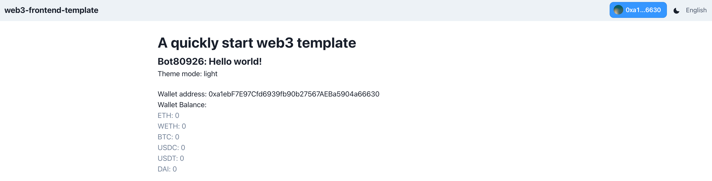

# web3-frontend-template
**Target: create a web3 front-end project with popular web3 framework.**




## Init Function
- MultiChain 
- Auto refresh wallet balances
- Different Theme 
- I18n

## Run 🏃
```
yarn && yarn dev
```

## Framework 🌞
- [Next.js](https://nextjs.org/docs)
- [wagmi](https://wagmi.sh/)
- [ethersV6](https://docs.ethers.org/v6/)
- [rainbowKit](https://www.rainbowkit.com/docs/introduction) (master branch)
- [web3Modal](https://web3modal.com/) (web3Modal branch)
- [react-redux](https://www.npmjs.com/package/react-redux)
- [react-toastify](https://www.npmjs.com/package/react-toastify)
- [SWR](https://swr.bootcss.com/)
- [next-i18next](https://github.com/i18next/next-i18next)
- UI framework
  - [Chakra UI](https://chakra-ui.com/)
  - [Styled-components](https://styled-components.com/)
  - I choose to use styled-components as an auxiliary style library, it's up to u

## Config
- Redux
  - default: user / transactions / balances
  - If u don't need the module, u can remove it as u want. This module is added because the author often uses :)
- Theme Config
  - src/config/theme
- Site Config
  - src/config/site
  - src/components/Layouts/Seo
- I18n Config
  - src/config/language
  - public/locales
  - next-i18next.config.js
  - default add EN & ZH-CN


## Inspiration 💡

  This project is inspired by and re-uses a lot of code from [Nexth](https://github.com/wslyvh/nexth/).
  
  Thx for powerful web3 community strength

